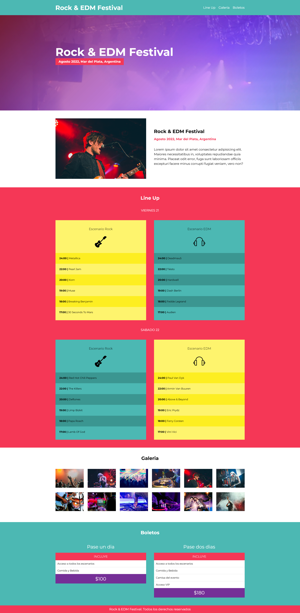

# Cotizador de Criptos

## Tabla de Contenido

- [Cotizador de Criptos](#cotizador-de-criptos)
  - [Tabla de Contenido](#tabla-de-contenido)
  - [Capturas](#capturas)
  - [Links](#links)
  - [Construido con](#construido-con)
  - [Autor](#autor)

## Capturas

  

## Links

- [Sitio Online](https://meek-marshmallow-bd9c2f.netlify.app/)

## Construido con

- HTML Semántico
- SASS/SCSS
- JavaScript

## Autor

- Linkedin - [@lucasscattolin](https://www.linkedin.com/in/lucas-scattolin/)
- Twitter - [@lucasscattolin](https://www.twitter.com/lucasscattolin)

